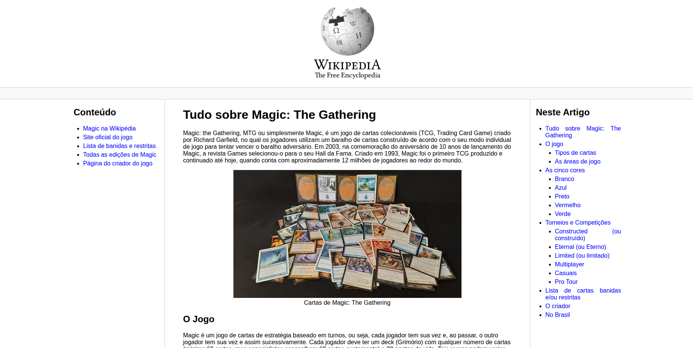

<h1><strong>Wikipedia New Layout</strong></h1>

<h2><strong>Descrição</strong></h2>

  O Wikipedia New Layout é um projeto que propõe uma versão mais acessível e organizada da interface da Wikipedia, desenvolvida com HTML5 e CSS3. O principal objetivo é melhorar a experiência de leitura e navegação, priorizando a acessibilidade para usuários de leitores de tela e a correta estrutura semântica do conteúdo.
  A interface foi construída com foco em hierarquia visual clara, contraste adequado e navegação por teclado, garantindo uma experiência inclusiva e funcional. Durante o desenvolvimento, foram aplicadas boas práticas de marcação e compatibilidade com o leitor de tela NVDA, tornando o site mais compreensível para todos os públicos.

<h2><strong>Funcionalidades</strong></h2>
<ul>
  <li align="justify">Layout responsivo e moderno inspirado em interfaces de portais de conhecimento.</li>
  <li align="justify">Organização semântica completa com tags adequadas e hierarquia bem definida.</li>
  <li align="justify">Foco em acessibilidade, com navegação fluida para leitores de tela e contraste otimizado.</li>
</ul>

<h2><strong>Demonstração do Projeto</strong></h2>

  
   
  <a href="https://williandpg.github.io/wikipedia-new-layout/" target="_blank"><strong>Acesse a demonstração</strong></a>

<h2><strong>Tecnologias Utilizadas</strong></h2>
<ul>
  <li align="justify"><a href="https://developer.mozilla.org/pt-BR/docs/Web/HTML" target="_blank"><strong>HTML5</strong></a>: Responsável pela estrutura semântica e hierarquia do conteúdo.</li>
  <li align="justify"><a href="https://developer.mozilla.org/pt-BR/docs/Web/CSS" target="_blank"><strong>CSS3</strong></a>: Utilizado para o design visual, tipografia e responsividade do layout.</li>
  <li align="justify"><a href="https://nvaccess.org/" target="_blank"><strong>NVDA</strong></a>: Ferramenta de leitura de tela usada para validar a acessibilidade do projeto.</li>
</ul>

<h2><strong>Estrutura do Projeto</strong></h2>

A estrutura do projeto é organizada da seguinte forma:

<pre><code>
/
├── index.html
├── assets/
│   ├── css/
│       └── style.css/
│   └── images/
│       ├── champ.png
│       ├── colors.png
│       ├── logo.png
│       ├── magic-banlist.png
│       ├── magic-in-br.png
│       ├── magic-the-gathering.png
│       └── wikipedia-logo.png
└── README.html
</code></pre>

<h2><strong>Contato</strong></h2>

  <strong>Willian Gonçalves</strong> | 
  <a href="https://www.linkedin.com/in/williandpg/" target="_blank"><strong>LinkedIn</strong></a> | 
  <a href="https://github.com/williandpg" target="_blank"><strong>Github</strong></a> | 
  <a href="https://williandpg.github.io/" target="_blank"><strong>Portfólio</strong></a> | 
  <a href="mailto:goncalves.wdp@outlook.com" target="_blank"><strong>Email</strong></a>

<h2><strong>Créditos</strong></h2>

  Projeto desenvolvido como parte da formação de HTML da DIO, com foco em estrutura, semântica e acessibilidade na construção de layouts modernos.

  
<strong>English Version</strong>

  <h1><strong>Wikipedia New Layout</strong></h1>

  <h2><strong>Description</strong></h2>
  

    The Wikipedia New Layout is a project that proposes a more accessible and organized version of the Wikipedia interface, developed with HTML5 and CSS3. The main objective is to improve the reading and navigation experience, prioritizing accessibility for screen reader users and the correct semantic structure of the content.
    The interface was built focusing on clear visual hierarchy, adequate contrast, and keyboard navigation, ensuring an inclusive and functional experience. During development, good markup practices and compatibility with the NVDA screen reader were applied, making the site more understandable for all audiences.
  

  <h2><strong>Features</strong></h2>
  <ul>
    <li align="justify">Modern and responsive layout inspired by clean web design principles.</li>
    <li align="justify">Fully semantic structure with proper HTML tag hierarchy.</li>
    <li align="justify">Accessibility-friendly navigation and optimized contrast for readability.</li>
  </ul>

  <h2><strong>Project Demonstration</strong></h2>
  

    
     
    <a href="https://williandpg.github.io/wikipedia-new-layout/" target="_blank"><strong>Access the demonstration</strong></a>
  

  <h2><strong>Technologies Used</strong></h2>
  <ul>
    <li align="justify"><a href="https://developer.mozilla.org/en-US/docs/Web/HTML" target="_blank"><strong>HTML5</strong></a>: Used for semantic structure and content hierarchy.</li>
    <li align="justify"><a href="https://developer.mozilla.org/en-US/docs/Web/CSS" target="_blank"><strong>CSS3</strong></a>: Used for visual styling, typography, and responsiveness.</li>
    <li align="justify"><a href="https://nvaccess.org/" target="_blank"><strong>NVDA</strong></a>: Screen reader tool used to validate accessibility.</li>
  </ul>

  <h2><strong>Project Structure</strong></h2>
  <pre><code>
  /
  ├── index.html
  ├── assets/
  │   ├── css/
  │       └── style.css/
  │   └── images/
  │       ├── champ.png
  │       ├── colors.png
  │       ├── logo.png
  │       ├── magic-banlist.png
  │       ├── magic-in-br.png
  │       ├── magic-the-gathering.png
  │       └── wikipedia-logo.png
  └── README.html
  </code></pre>

  <h2><strong>Contact</strong></h2>
  

    <strong>Willian Gonçalves</strong> |
    <a href="https://www.linkedin.com/in/williandpg/" target="_blank"><strong>LinkedIn</strong></a> |
    <a href="https://github.com/williandpg" target="_blank"><strong>Github</strong></a> |
    <a href="https://williandpg.github.io/" target="_blank"><strong>Portfolio</strong></a> |
    <a href="mailto:goncalves.wdp@outlook.com" target="_blank"><strong>Email</strong></a>
  

  <h2><strong>Credits</strong></h2>
  

    This project was developed as part of the HTML training at DIO, focusing on structure, semantics, and accessibility in the construction of modern layouts.
  

